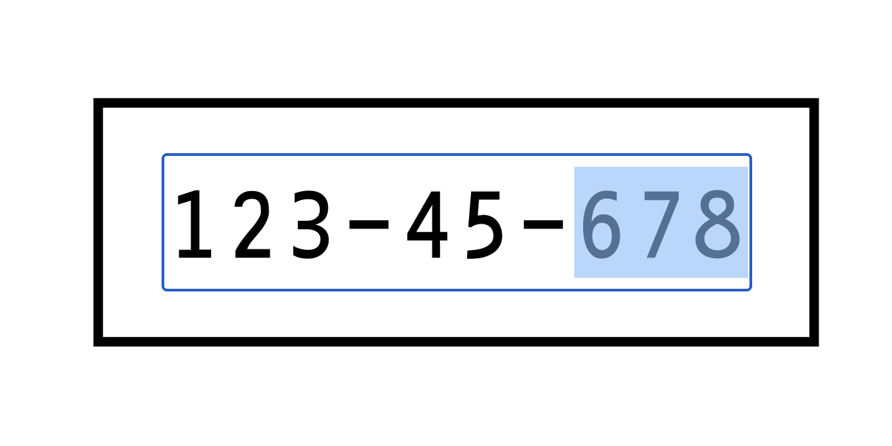

# hk-scancard
A simple webapp that displays a HomeKit setup code in a HomeKit-compatible scancard format. This is mostly helpful for HAP device makers.

[🔗 Live Demo](https://aaaidan.github.io/hk-scancard/)

## Features

* You can use a "deep link" to easily create a link to a scannable HomeKit code. Just paste the code you want to use, and the URL bar will update with your deep link.
* Print the webpage to convert to a PDF.
